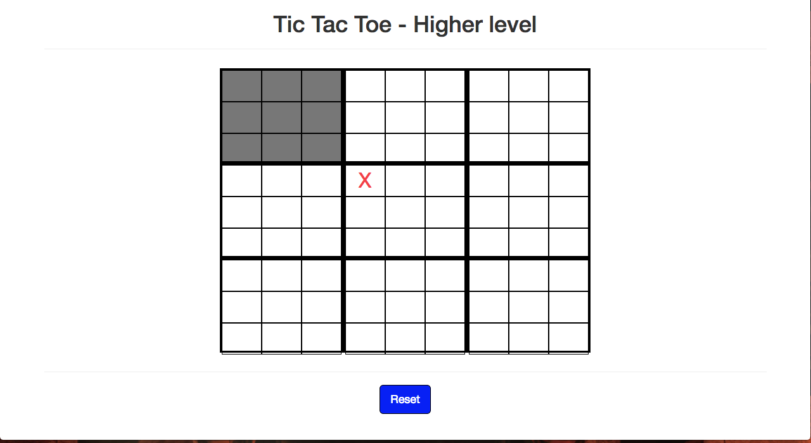

# Tic-Tac-Toe-HL
The classic game of Tic-Tac-Toe taken to a higher level.

# Guide
The rules are simple
* The conditions for winning are the same as the original Tic-Tac-Toe game.
* The first player can use whichever of the big matrix to start.
* But, the second player should use the matrix of the coordinate that the first player chose, and so on.
* The correct matrix will be shown in grey for clarifying. Like this: 

# Play it!
You can test the game [here](https://ricglz0201.github.io/Tic-Tac-Toe-HL/) 
